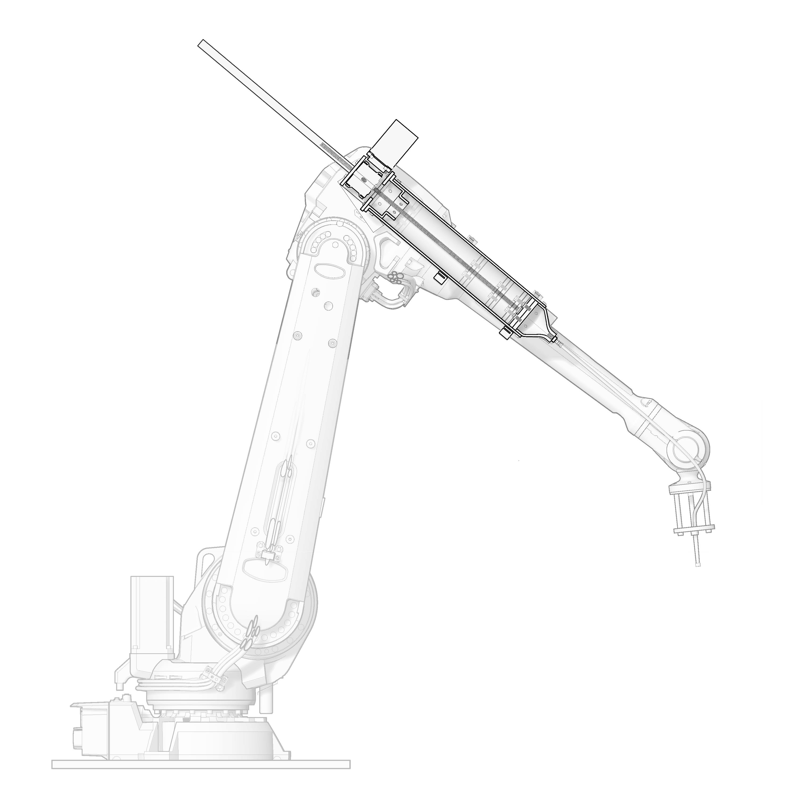

### CERA: Ceramic Extruding Robot Arm
###### January 2019 - Present
##### **Kevin Guo**, Madeleine Eggers, Karolina Piorko, Veronika Varga, Jenny Sabin

*CERA fully assembled*

For Spring 2019, I took [Prof. Jenny Sabin\'s](http://www.jennysabin.com/) research seminar in Matter Design Computation. As part of the seminar, I worked on a brand-new extruder system for the lab\'s Sulla robotic arm, a system we call CERA (Ceramic Extruding Robot Arm). I continued work on it through the Summer and into Fall 2019.

### Background

In the past, the Lab used a pneumatic ceramic extruder system used for [RoboSense 2.0](https://static1.squarespace.com/static/5783b6f903596e5098f3fce8/t/5c3774c7352f539da89eceb8/1547138275044/Robosense+2.0.pdf). This system had a few issues; the pneumatics were independent of the robot so there was no coordination between the robot and the extruder. Also, pneumatic controls were very coarse, only allowing for a change in pressure. For the next iteration of RoboSense, we wanted to make a fabrication method that would allow for the construction of fine detailed objects such as [PolyBrick](http://www.jennysabin.com/polybrick/) in an architectural scale.

### Design

*Exploded view of CERA*

*Cutaway diagram of CERA on robot arm*

The overall design of CERA is centered around a 2ft long 4.5in diameter aluminum tube with a plunger inside. The plunger is attached to a leadscrew, which itself is driven by a worm gearbox. This gearbox is powered by a 1712oz-in NEMA34 Closed Loop Stepper Motor.

### Mechatronics

#### Motor

*1712oz-in NEMA34 Closed Loop Stepper Motor*

One of the first decisions that had to be made was which motor to use for the extruder. A stepper motor powered extruder was attempted before in the lab but had to be abandoned as discrepancies between the motor\'s reported and actual position made it virtually impossible use accurately. That ultimately blocked progress on RoboSense and forced it to be shelving until I arrived at the lab.

I stuck with using a stepper motor as I had used them extensively in previous roles and knew that a stepper would have the requisite torque to push clay through a tube. To deal with problems with positioning, I chose a closed-loop stepper motor system, a stepper motor with a built-in encoder that corrects for any discrepancies in motor position. 

#### Machina

To command the robot, we decided upon [Machina](https://github.com/RobotExMachina), an open-source framework for robots that allows for real-time control and feedback. This allowed for us to control the robot directly from either a PC Desktop or from Grasshopper without the need for predefining a sequence of actions or using RobotStudio, ABB\'s proprietary programming software for its robots. It also had a large set of commands that allow for a rich set of functionality including for digital I/O communication detailed below. 

#### Digital I/O Communication

*Inside of an ABB IRC5*

The next step was figuring out how to communicate between Grasshopper, the robot, and CERA all at once. The initial communication system involved using Firefly, a Grasshopper plugin for microcontrollers, to send Serial messages over a very long USB cable in this format: `Steps/Pulse Width`. So the Serial message `500/250` would be read by the Arduino as move 500 steps counterclockwise with a 250 µs delay in between pulses.

While this solution was simple to implement, it didn\'t solve the inherent separation between robot movement and extruder action that would inevitably create issues with fabrication down the road. There had to be a new system that allowed for native communication the robot to control the extruder and any other components attached.

After some searching, I learned that the ABB IRC5 robot controller that we were using had a I/O module built in called an DSQC 652. More importantly, the DSQC 652 had 16 digital outputs. A digital output is only capable of spitting out a 1 or a 0, but that would be enough.

Two digital outputs from the ABB\'s I/O module are wired from the inside of the IRC5 controller, past a barrier wall, up the robot arm, and onto the mounting plate with the Arduino board. One digital output dictates which direction the stepper motor would turn (On means clockwise, Off means counter-clockwise), which dictates whether the extruder piston goes forward or back. The other digital output is an On/Off switch for the stepper motor; as long as the output was On, the motor would make another "step" and continue rotating.

These outputs made it very easy to synchronize actions between robot and extruder. As all commands went through Machina and therefore the robot, the sequence guaranteed extrusion concurrent with robot movement.

##### Example Command Sequence

| Command | What it does |
|-------------| ------------- |
|`digitalWrite(DO10_2, True)`| Sets direction of motor to move plunger forward |
|`digitalWrite(DO10_1, True)`| Turns on stepper motor |
|`wait(<time in milliseconds>)`| Gives extruder some time to "prime" |
|`move(<some vector>)`| Moves robot a certain amount |
|`digitalWrite(DO10_1, False)`| Turns off stepper motor |

	

		
		
		<em>CERA extruding ceramic for a "line test"</em>
		
	

*Full results of first CERA line test*

### Adapative Print

Adaptive print is a new part of RoboSense 3.0 that incorporates work done [previously](http://www.ttistengteng.com/PicDetail.aspx?id=489) and will involve surface reconstruction from a Kinect.

#### This page will be updated with more information as work progresses. Stay Tuned!