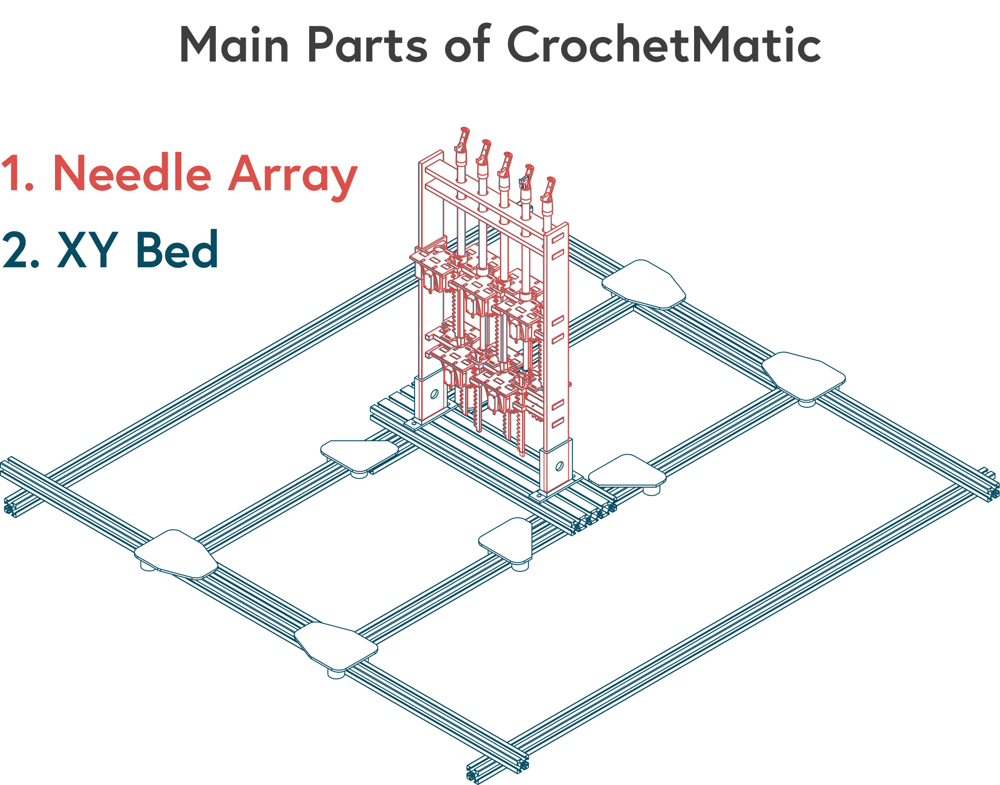
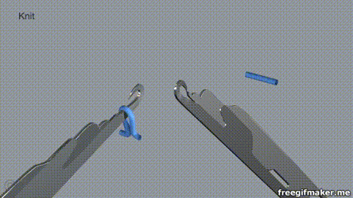
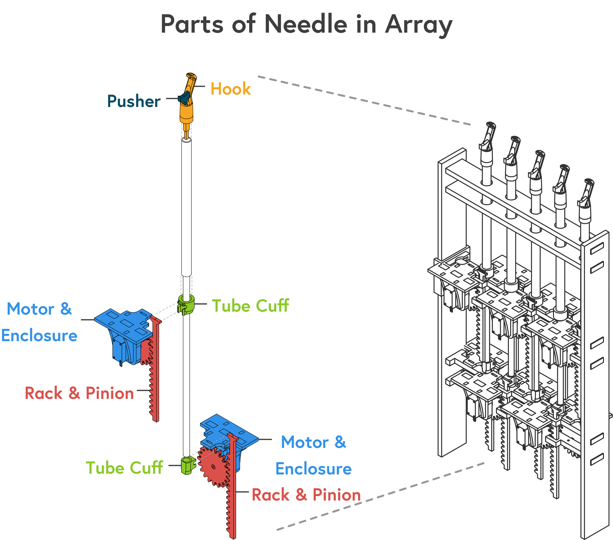
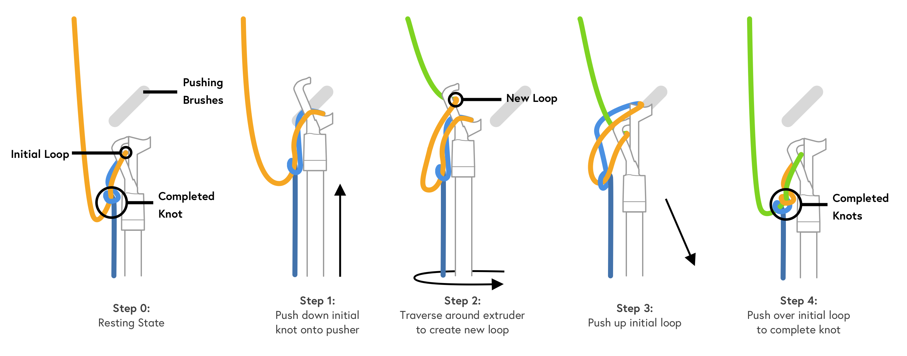
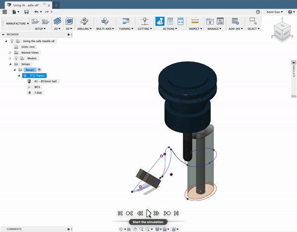

### CrochetMatic: Volumetric 3D Knitting
###### May 2017 - May 2018
##### **Kevin Guo**, Olav Imsdahl, François Guimbretière, Scott Hudson

	

		
	

	

		
	

I worked on CrochetMatic during my time at [Prof. François Guimbretière](https://www.cs.cornell.edu/~francois/)\'s Design Lab. CrochetMatic was easily one of the most time-consuming and difficult projects. While I didn\'t reach the ultimate goal, I believe that I learned an immense amount from my struggles with this project.

### The Start

The initial idea was to build a machine that could build knitted objects the same way 3D printers build their prints: additive and layer-by-layer. But while plastic has relatively predictable properties and can be put through an extruder, a length of yarn\'s properties can change from bundle to bundle. Also, it can get caught on small mechanisms which makes it hard to build around. Furthermore, the idea of knitting entire 3D volumes (both the exterior and interior), whether by hand or machine had never really been tried before. The closest antecedent to the project was [a 3D knitting compiler](https://www.disneyresearch.com/publication/machine-knitting-compiler/) from Carnegie Mellon University but even that knitting compiler only created knitted tubes that had to be filled afterwards.

At the suggestion of [Prof. Steve Marschner](http://www.cs.cornell.edu/~srm/), the preeminent computer graphics professor at Cornell (he won an Oscar for his CG research), the individual knits were throught of as a series of voxels, or volumes in a 3D grid. This was coming off of his previous work simulating knit clothes [(more details here.)](http://www.cs.cornell.edu/projects/YarnCloth/)

### Simulations

After spending the first two weeks of summer learning how to knit, I learned that the knits followed a regular pattern and that the best way to make a "layer" of knits was to spiral outwards in with a series of concentric layers. Each individual layer would be independent of the ones inside and outside of it except for "linking" knits that connected that layer to the one outside of it. I ended up building computer models in Fusion360 of each type of knit that would conform to the voxels.

	

		
		
		<em>Initial observation sketch of a unit voxel</em>
		
		
		
		<em>Final modeled basic knit voxel</em>
		
	

	

		
		
		<em>Initial observation sketch of a junction voxel</em>
		
		
		
		<em>Final modeled junction knit voxels</em>
		
	

Each knit followed a path of points, which I was able to export and joint together to form a single "strand" of points. This strand was inputted into a modified version of a [C++ rod simulator](https://www.cs.cornell.edu/projects/rodsound/) developed by one of Prof. Marschner\'s PhDs [Eston](https://www.cs.cornell.edu/~ers/). Each simulation, even though only one second long, required hours of computation, a couple took over 24 hours. But in the end, we got the results, which seemed to match the real life knits I made.

	

		
		
		<em>Simulating a single layer</em>
		
	

	

		
		
		<em>Simulating  multiple layers</em>
		
	

	

		
		
		<em>Knitted "Cube" I made</em>
		
	

### Building the Machine

With an idea of what the final knits would look like, it was onto building the machine itself, which was made up of two separate parts:
1. An XY Bed powered by an Arduino Mega and RAMPS board
2. An array of needles powered by a Teensy 3.5 board

### XY Bed
The XY bed was built and assembled by [Prof. Scott Hudson](https://hcii.cmu.edu/people/scott-hudson) from Carnegie Mellon University. Based off a regular 3D printer bed, it\'s made up of a 80-20 frame driven by an Arduino Mega with a RAMPS board mounted on it. The Arduino Mega controlled most of the movements on the machine with a RAMPS 1.4 board. The RAMPS board was typically meant for building DIY 3D printers, but because of CrochetMatic didn\'t have a heating element, I had to put two resistors and a potentiometer (a dial) attached to where the heat sensors were supposed to be. This was to trick the board into thinking that there is a heating element on the machine (there isn’t) so that it will use the extruder properly (how the latch servos and the yarn extruder are operated).

### Needle Array
3D knitting (or Volumetric knitting) was untried while I was working on the project, and the most daunting part was figuring out how to build the needles. The idea was to build an entire "bed" of needles, but what they would look like and how they would work was completely unknown. We couldn\'t copy them from existing knitting machine needles, which are meant solely for flat 2D planes, but we could use some of the basics of the designs to base how the needles would work. The most helpful was [A Compiler for 3D Machine Knitting](https://www.disneyresearch.com/publication/machine-knitting-compiler/) made in Carnegie Mellon University, which described a way to make knitted 2D shells of 3D forms. The computer simulations provided created a starting point of understanding how the knits would interact with each other.

*Simulation of a single knit on an industry knitting machine from [A Compiler for 3D Machine Knitting](https://www.disneyresearch.com/publication/machine-knitting-compiler/)*

The needles for our machine went through multiple iterations, with each version drastically different from the previous versions.

	

	
		<em>Initial Needle Design</em>
	

	

		
		<em>Needle Design 7.0</em>
	

	

		
		<em>Final Needle Design</em>
	

The final needle version required minimal custom parts and instead relied upon off-the-shelf 0.125\" and 0.25\" diameter aluminum rods nested in one another. The hooks and pushers were 3D printed and manually fitted onto the pipes using force, glue, and rolled-up masking tape. The outer and inner components were each driven by rack-and-pinion mechanism with a motor module. Each module had an SG90 servo motor, which were not only small but also cheap, meaning that each needle could be driven by two motors.

Each row would have in total 5 different needles, meaning that there would have to be a total of 10 servo motors driven. The end goal was to eventually have an entire series of these 5 needle rows to built.

### Making the Knits

With all these pieces, perhaps the most difficult part of the project was programming the movement of the machine. In most other knitting machines which make knits in two dimensions, this is simpler as the yarn is relatively restricted in where it can go and any knot is pulled either on the left or the right. However, in three dimensions where a single knot can have tension coming from six different sides, it\'s incredibly difficult to accurately predict how the yarn will behave when something is done to it. 

After building a unit version of the needle, I made a sequence of motions to create knits by hand and the actuated needle, which you can see below:

*Looping by hand*

These motions were turned into the 4 separate steps you see below, which formed the basis of the ultimate sequence for creating knits.

*Steps to create a knit*

However, translating the steps to machine movement was incredibly challenging. Because the XY bed was built using off-the-shelf components meant for 3D printers, the code driving the machine was built off of [Repetier](https://www.repetier.com/), an existing Arduino-based firmware. That meant that the machine could be moved through gcode, the language used for most existing 3D printers and CNC machines. However, there needed to be a couple modifications to make the firmware work with the motion.

| Command | Original Definition | Modified Definition | Usage |
|-------------| ------------- | ------------- | ------------- |
|`L`| No `L` defined in Repetier | Selects a needle to be actuated | `L<index of desired needle>` |
|`E`| Length of material to be extruded | Distance that the pusher moves (in mm) | `E<desired distance>` |
|`Z`| Distance a 3D printer bed goes in Z-direction | Distance the hook moves (in mm) | `Z<desired distance>` |
|`F`| Feed rate for extruder | Speed at which the machine moved | `F<desired speed>` |

Each new command was added or edited in the Commands.cpp file of the Repetier firmware. A Github repo with the modified firmware along with all sorts of other related code can be found [here](https://github.com/kevinguo344/CrochetMatic).

There were also problems ensuring that the servos, which were chosen for their inexpensive price rather than precision, could perform the repicate the exact motion from needle to needle reliably. The solution was to exaggerate the movements of the needle to ensure that each motion would complete its requisite task.

*An early version of the five needle row. Even though the needles are programmed to move identically, the actual movements are far from identical.*

In order to plan for how the needle would move, I used the CAM function built into Fusion360 with the simulated CAM tool as a stand-in for the needle, a fixed tube as analog for where the yarn was extruded from, and 2 tilted boxes representing the pushing brushes. 

*Simulating needle movement in Fusion360*

With the toolpaths set, I could output a G-code file from Fusion360, which after further editing and modification, worked with the machine. And all the changes paid off when at the end of May 2018, I was able to make the machine knit a 5-needle wide scarf (almost) entirely without human intervention.

	

		<iframe width="560" height="250" src="https://drive.google.com/file/d/1NX24JxTp0RCihOpacNhDnv6LlEIOh0n9/preview"></iframe>
	

	

	
		A scarf made on CrochetMatic
	

To get to this point required months of work, experimentation and false starts and for CrochetMatic to fully achieve the initial vision of fully volumetric 3D-knitting will require more work. Fortunately, it\'s currently in the competent hands of [Xiaoxiang Ma](http://www.xiaoxiangma.ml/), [Alicia Wang](https://github.com/aliciaxw), and [Amrit Kwatra](http://amritkwatra.com/).

To see the firmware for CrochetMatic, checkout the repository [here](https://github.com/kevinguo344/CrochetMatic).

### The End