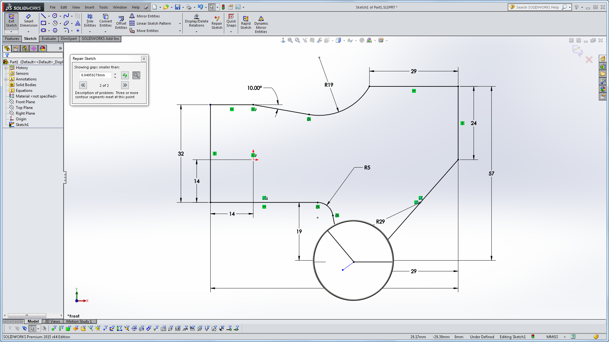
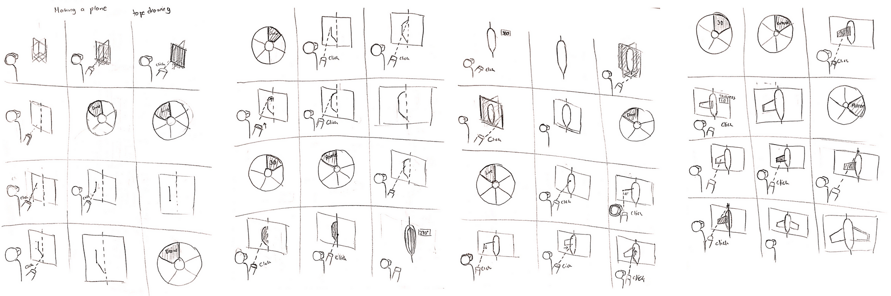
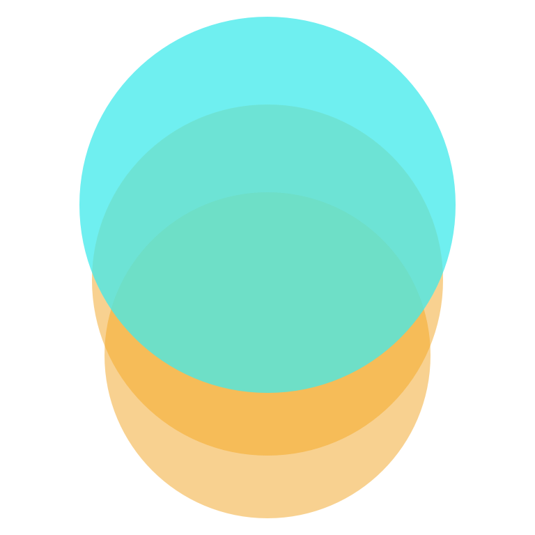
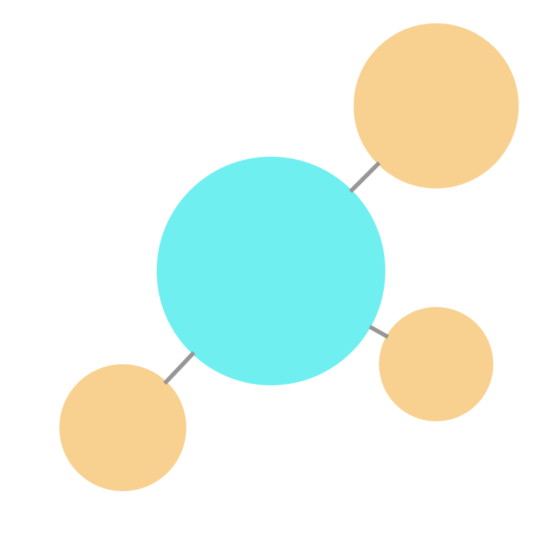
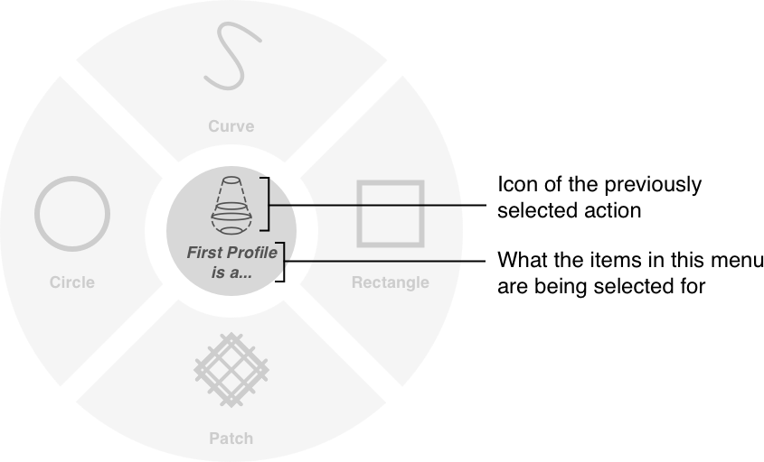
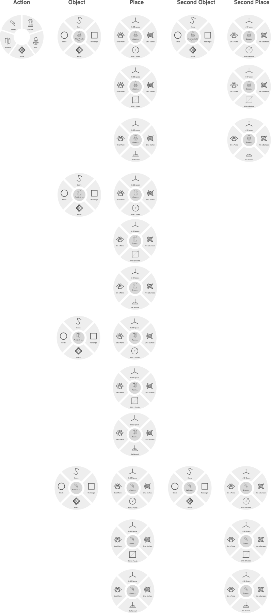
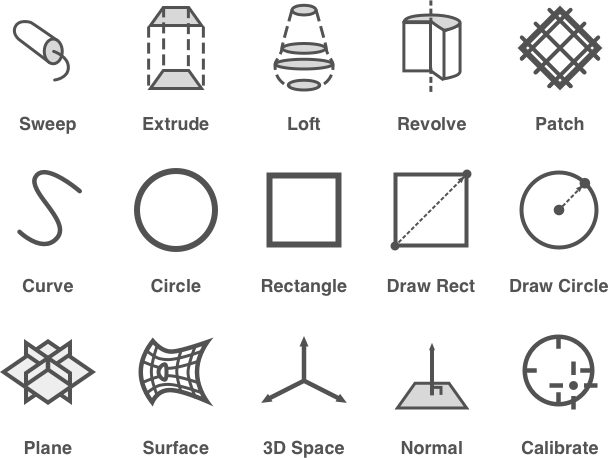
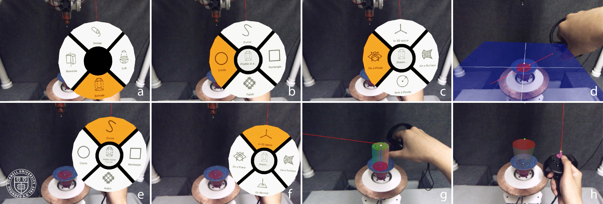
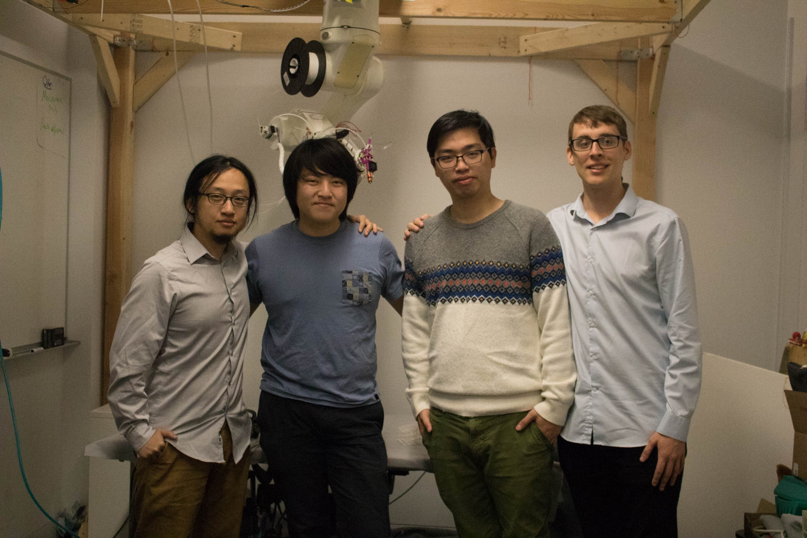

### RoMA: Interactive Fabrication with a Robotic 3D Printer
###### January 2017 - September 2017

*That's me in the pic!*

##### Huaishu Peng, Jimmy Briggs, Cheng-Yao Wang, **Kevin Guo**, Joseph Kider, Stefanie Mueller, Patrick Baudisch, François Guimbretière
##### 2018 Conference on Human Factors in Computing Systems **(CHI 2018)** 
[Read the Paper here](https://drive.google.com/file/d/1dfZdkDhoW0ewAtWpj-f13B29UcXLNtwD/view?usp=sharing)

<iframe width="720" height="405" src="https://www.youtube.com/embed/K_wWuYD1Fkg" frameborder="0" allow="accelerometer; autoplay; encrypted-media; gyroscope; picture-in-picture" allowfullscreen></iframe>

### Abstract
We present the Robotic Modeling Assistant (RoMA), an interactive fabrication system providing a fast, precise, hands-on and in-situ modeling experience. As a designer creates a new model using RoMA AR CAD editor, features are constructed concurrently by a 3D printing robotic arm sharing the same design volume. The partially printed physical model then serves as a tangible reference for the designer as she adds new elements to her design. RoMA\'s proxemics-inspired handshake mechanism between the designer and the 3D printing robotic arm allows the designer to quickly interrupt printing to access a printed area or to indicate that the robot can take full control of the model to finish printing. RoMA lets users integrate real-world constraints into a design rapidly, allowing them to create well-proportioned tangible artifacts or to extend existing objects. We conclude by presenting the strengths and limitations of our current design.

### UI/UX

My main role within the project was designing and implementing the interface for the augmented reality CAD editor. The main UI element in the program was the marking menu, which allowed users to select a drawing operation from the controller. Clicking the joystick would open the menu and the user would be able to select a menu item simply by moving the joystick to the sector of the menu and clicking or holding the joystick in that position.

The process of making an object in almost every CAD program starts off very similar to the screenshot below...

*What a 2D sketch looks like on Solidworks, an existing CAD application*

...as a flat 2D drawing. While this is great for precise shapes on blank backgrounds with experienced users on a flat screen, it wouldn\'t make much sense in an AR environment with users who weren\'t entirely familiar with modeling software. 

I proposed a hybrid system, in which the user would point and "project" a 2D element such as a curve or a line or a point onto a selected plane. Below is the 4 page storyboard I made of a user creating an airplane using the hybrid system in RoMA.

*My initial idea for a workflow, which borrowed heavily from the 2D sketching framework I knew from being a Solidworks user*

While it could work, after some discussion with the rest of the team, I realized that such a system wouldn\'t take full advantage of working in AR. We came to a compromise, drawing elements free floating in 3D space with the exception of certain actions that required elements to be defined by a plane or a surface (such as rotation or lofting).

I proposed 3 menu interaction schemes and made interactive Javascript prototypes to demonstrate them in Framer (all three prototypes are below).

	

		<h4>Stack Menu</h4>
		
	

	

		<h4>Tree Menu</h4>
		
	

	

		<h4>Ring Menu</h4>
		
	

	

		<iframe class="framer" src="https://framer.cloud/ilfyY/"></iframe>
	

	

		<iframe class="framer" src="https://framer.cloud/agbTc/"></iframe>
	

	

		<iframe class="framer" src="https://framer.cloud/HcxQi/"></iframe>
	

The stack menu was chosen as the menu because it was the easiest to implement, didn\'t clutter up too much of the user\'s field of view, and conformed more directly to the user\'s actions. However, I realized pretty early on that the stack menu\'s design made it hard to remember what action was chosen and what you had to do to complete the task. To aid with that, I used the blank space in the middle of the menu as a reminder of why an item or action needed to be selected (shown below).

*The Logical Structure of the Marking Menu*

	

		
		<em></em>
	

I had to make one for every action and as you can see below...

*These took a while to make*

...there were a lot of them. Along with the menus, I created a whole new set of icons for RoMA.

*An entirely new set of icons for RoMA*

After wrangling with a custom C# engine specifically for RoMA [(courtesy from the talented Jimmy Briggs)](http://jimmybriggs.net/), my marking menu eventually was integrated with the system and was demoed for interested researchers and designers alike.

*Marking menu in action in the AR CAD editor*

*(From left to right) Huaishu Peng, Eric (Cheng-Yao) Wang, Me (Kevin Guo), & Jimmy Briggs. The best team I could ask for.*