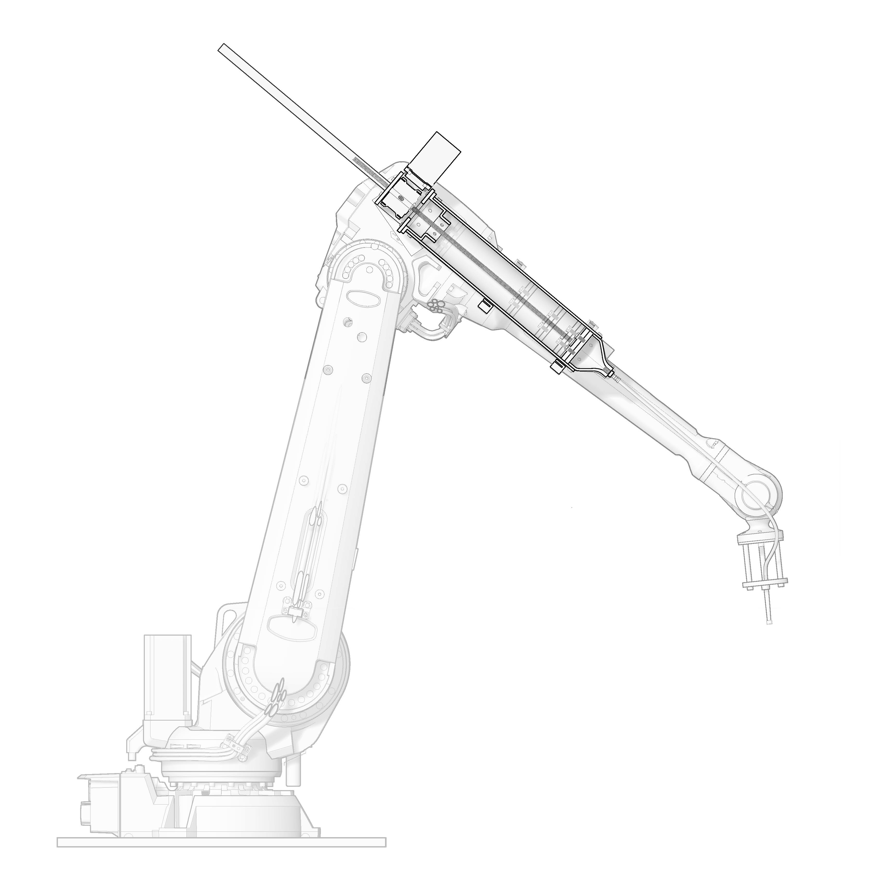

### CERA: Ceramic Extruding Robot Arm
###### January 2019 - Present
##### People: **Kevin Guo**, Madeleine Eggers, Karolina Piorko, Veronika Varga, Jenny Sabin

*CERA fully assembled*

For Spring 2019, I took [Prof. Jenny Sabin\'s](http://www.jennysabin.com/) research seminar in Matter Design Computation. As part of the seminar, I worked on a brand-new extruder system for the lab\'s Sulla robotic arm, a system we call CERA (Ceramic Extruding Robot Arm). I continued work on it through the Summer and into Fall 2019.

### Background

In the past, the Lab used a pneumatic ceramic extruder system used for [RoboSense 2.0](https://static1.squarespace.com/static/5783b6f903596e5098f3fce8/t/5c3774c7352f539da89eceb8/1547138275044/Robosense+2.0.pdf). This system had a few issues; the pneumatics were independent of the robot so there was no coordination between the robot and the extruder. Also, pneumatic controls were very coarse, only allowing for a change in pressure. For the next iteration of RoboSense, we wanted to make a fabrication method that would allow for the construction of fine detailed objects such as [PolyBrick](http://www.jennysabin.com/polybrick/) in an architectural scale.

### Design

	

		
		
		*Exploded view of CERA*
		
	

	

		
		
		*Cutaway diagram of CERA on robot arm*
		
	

The overall design of CERA is centered around a 2ft long 4.5in diameter aluminum tube with a plunger inside. The plunger is attached to a leadscrew, which itself is driven by a worm gearbox. This gearbox is powered by a 1712oz-in NEMA34 Closed Loop Stepper Motor.

### Mechatronics

#### Motor

*1712oz-in NEMA34 Closed Loop Stepper Motor*

One of the first decisions that had to be made was which motor to use for the extruder. A stepper motor powered extruder was attempted before in the lab but had to be abandoned as discrepancies between the motor\'s reported and actual position made it virtually impossible use [accurately](http://www.ttistengteng.com/PicDetail.aspx?id=489).

I stuck with using a stepper motor as I had used them extensively in previous roles and knew that a stepper would have the requisite torque to push clay through a tube. To deal with problems with positioning, I chose a closed-loop stepper motor system, a stepper motor with a built-in encoder that corrects for any discrepancies in motor position. 

#### Digital I/O Communication

The next step was figuring out how to communicate between Grasshopper, the robot, and CERA all at once. The initial communication system involved using Firefly, a Grasshopper plugin for microcontrollers, to send Serial messages over a very long USB cable in this format: `Steps/Pulse Width`. So the Serial message `500/250` would be read by the Arduino as move 500 steps counterclockwise with a 250 µs delay in between pulses.

While this solution was simple to implement, it didn\'t solve the inherent separation between robot movement and extruder action that would inevitably create issues with fabrication down the road. There had to be a new system that allowed for native communication the robot to control the extruder and any other components attached.

After some searching, I learned that the ABB IRC5 robot controller that we were using had a I/O module built in called an DSQC 652. More importantly, the DSQC 652 had 16 digital outputs. One digital output is only capable of spitting out a 1 or a 0. But with two outputs, the output could be any number between 0 and 3 in binary (00, 01, 10, 11). With 15 outputs (1 output is reserved for saying whether the number is negative or positive), the output could be any number between 32767 and -32768.

Building out the system was tricky. There were few references as to how to connect the IRC5 to an Arduino. 

### Grasshopper

### Kinect???

### Come Back Later for Updates!

Polybrick has already gone through one version [previously](http://www.jennysabin.com/polybrick/). This new version of Polybrick is inspired by the microstructures that exists inside bone, with the goal of creating a material that is strong, materially efficient, and has properties not found in regular brick or other existing material. My role will focus on the robotic fabrication aspect of the project, using the Sulla robotic arm and other technologies to explore how to build Polybrick structures.