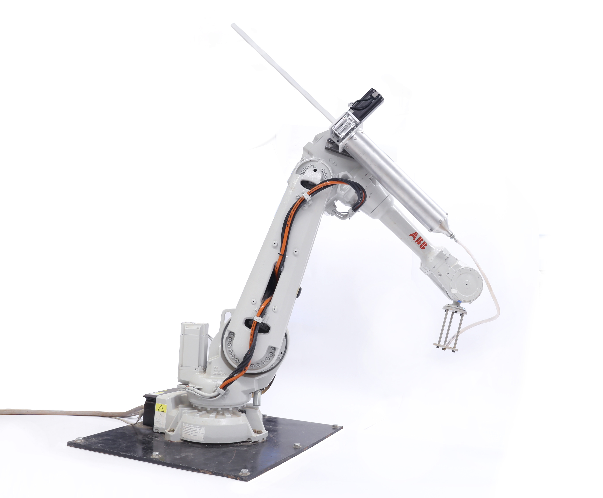

### CERA: Ceramic Extruding Robot Arm
###### January 2019 - Present

*CERA fully assembled*

For Spring 2019, I took [Prof. Jenny Sabin\'s](http://www.jennysabin.com/) research seminar in Matter Design Computation. As part of the seminar, I worked on a brand-new extruder system for the lab\'s Sulla robotic arm, a system we call CERA (Ceramic Extruding Robot Arm).

will be working on the next version of Polybrick, a project in Prof. Sabin\'s lab. 

### Background

In the past, the Lab had used a pneumatic ceramic extruder system

### Motors

One of the first decisions 

### Digital I/O Communication

### Grasshopper

### Kinect???

### Come Back Later for Updates!

Polybrick has already gone through one version [previously](http://www.jennysabin.com/polybrick/). This new version of Polybrick is inspired by the microstructures that exists inside bone, with the goal of creating a material that is strong, materially efficient, and has properties not found in regular brick or other existing material. My role will focus on the robotic fabrication aspect of the project, using the Sulla robotic arm and other technologies to explore how to build Polybrick structures.