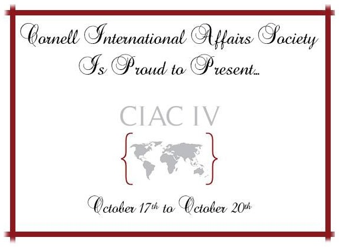
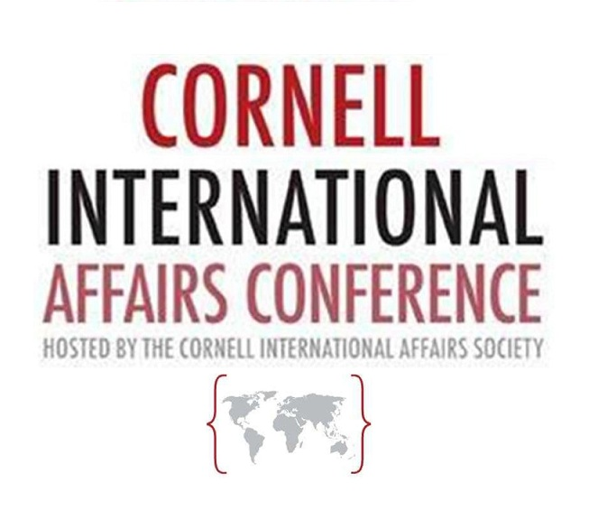
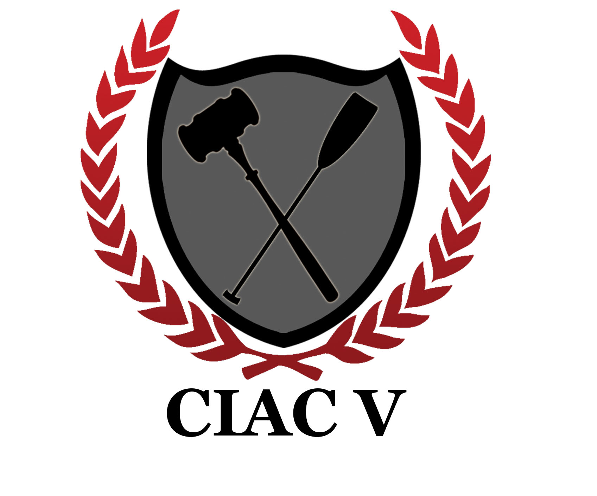
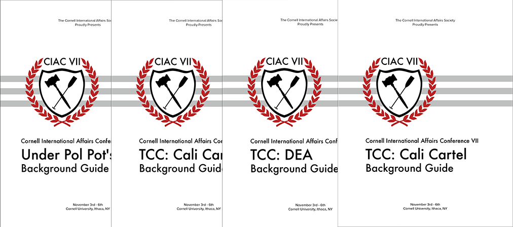
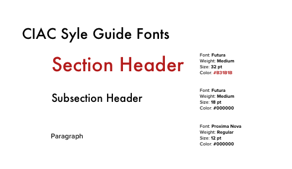
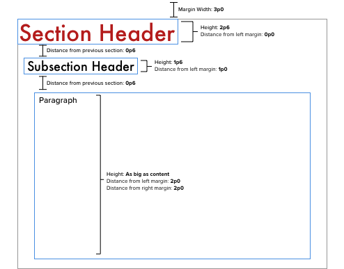

### Cornell International Affairs Society
###### December 2016 - November 2017

As Director of Tech of the Cornell International Affairs Society\’s college Model UN conference, I decided to change the messy branding of years past with a new consistent identity. Included in that was a cleaning up of the existing logo, and the creation of multiple new assets and a single standard for all printed material during the conference.

	

		
		*The final logo and motif for CIAC*
	

Normally, Director of Technology is a caretaker role, ensuring what was made previous years is updated for the current year\'s conference. But I wasn\'t content to just be caretaker. Instead, I evaluated the state of the conference\'s branding and found a few things. In previous years, the branding used seemed confused, inconsistent, or downright bad.

	

		
	

	

		
	

	

		
	

	

		*Examples of previous years\' branding work*
	

We were a relatively new conference, dwarfed by others hosted by the likes of Yale, Harvard, and Penn, and so our image was important to how we did. If anything was going to sink us, it shouldn\'t be bad design. After cleaning up and vectorizing the main CIAC shield logo, I developed the motif of the ribbon. The ribbon could symbolize anything from gift wrapping to a sash, which was furthered by the pseudo-heraldic shield that was in the new logo. Either way, any document with this motif on it would make the reader feel special, as if they were opening a gift or receiving a noble reward. It was applied to all the documents distributed to delegates during the conference along with packets sent to all potential sponsors.

	

		
		*Documents from CIAC VII showing off the ribbon motif*
	

In order to preserve these changes and maintain consistency, I created a style guide for any future directors of tech who will need to make new documents and assets.

	

		
	

	

		
	

