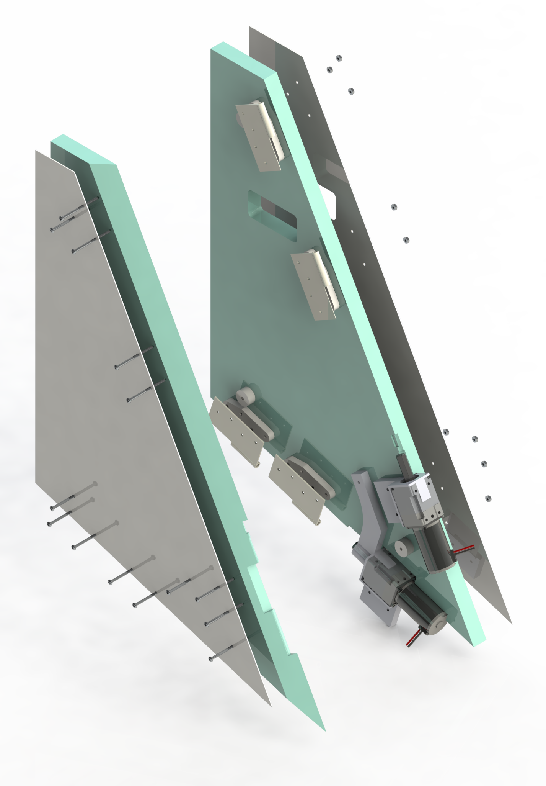

### communIT
###### January 2019 - Present
##### People: **Kevin Guo**, Carlos Aguiar, Alex Zhu, Keith Green

*A rendering of communIT*

As part of my Master of Engineering (MEng) in Mechanical Engineering, I will be working on communIT, a project of Prof. Keith Green\'s [Architectural Robotics Lab (ARL)](https://arl.human.cornell.edu/). transFORM is a room-scaled, kirigami-inspired robotic environment for public spaces. For more information, go to the [ARL page on transFORM](https://arl.human.cornell.edu/research-transFORM.html).

### Background

I\'ve always been interested in architecture and for my [Kessler Fellowship](https://www.engineering.cornell.edu/students/undergraduate-students/entrepreneurial-options-undergrad-students/kessler-fellows-program) the summer of my junior year, I interned at [Ori Inc](https://oriliving.com/), an MIT Media Lab spinoff building robotic furniture for urban apartments. During my time at Ori, I became increasingly interested in applying architectural robotics to the public realm. After all, if we could make apartments responsive, couldn\'t we do the same for a public plaza that was used by all walks of life? That\'s why I wanted to work on communIT when I returned to Cornell.

### User Research & Concept Design

The previous version of communIT was an non-functional full-scale prototype that was made out of particle board and cardboard with velcro squares attached throughout the sides. Carlos Aguiar conducted user studies with this protoype over a course of 5 weeks in which pairs of students at Cornell would "co-design" by reconfiguring the prototype, attach "peripherals," and act out the activities they\'d want do with an actual working communIT. The point of these exercises was to see what people would use communIT for, what features they wanted in a working version, and what design shortcomings were present with the existing version.

These findings were then sorted into 17 specific use cases and 6 overall themes:
1. Reading
2. Presenting
3. Office Work
4. Relaxing/Watching
5. Playing
6. Exhibiting Artwork

*All design cases and user scenarios*

The next version of communIT needed to support all these activities.

	

		
		
		*Scale model of initial version of communIT*
		
	

	

		
		
		*Scale model of another proposed design for communIT*
		
	

*Scale model of final design for communIT*

### Assembly Design & Manufacturing

*Exploded view of the panel assembly*

	

		
		
		*Two panels closed with acrylic surface*
		
	

	

		
		
		*Two panels opened with LED grooves and strips *
		
	

### Come Back Later for Updates!