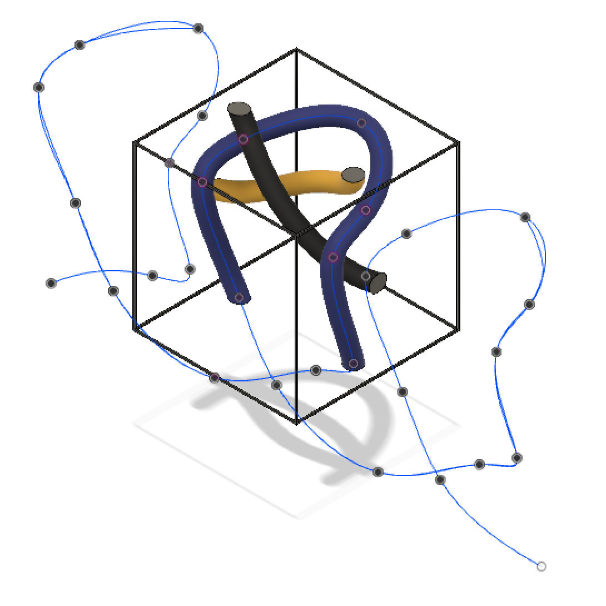
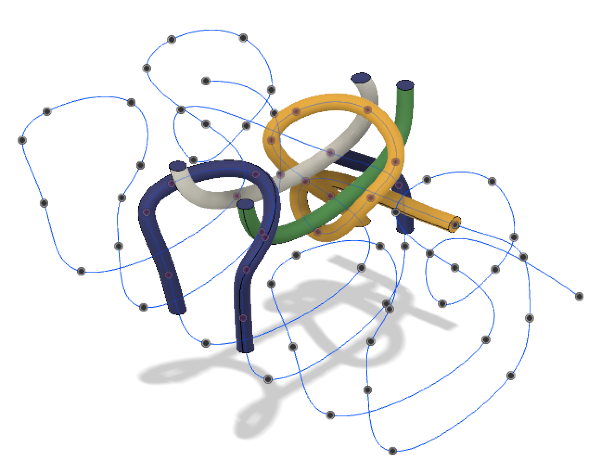
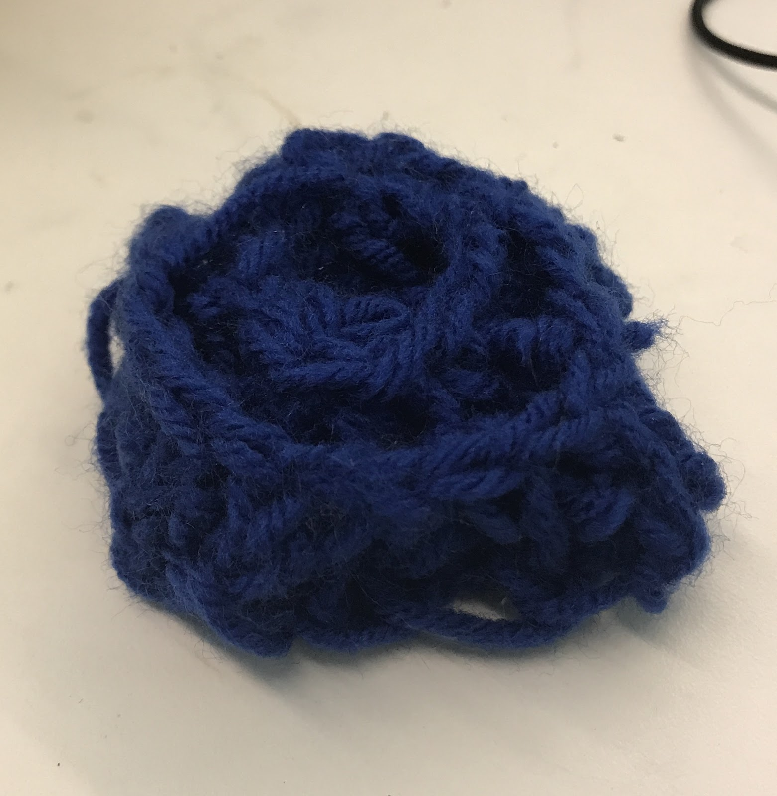
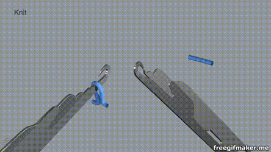
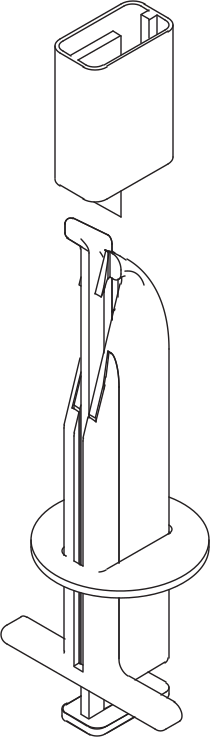
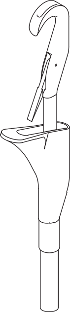
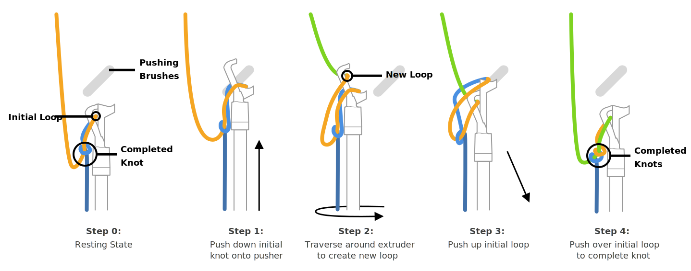

### CrochetMatic: Volumetric 3D Knitting
###### May 2017 - May 2018
##### People: **Kevin Guo**, Olav Imsdahl, François Guimbretière, Scott Hudson

I worked on CrochetMatic during my time at [Prof. François Guimbretière\'s Design Lab](https://www.cs.cornell.edu/~francois/). CrochetMatic was easily one of the most time-consuming and difficult projects. While I didn\'t reach the ultimate goal, I believe that I learned an immense amount from my struggles with this project.

### In the Beginning...

The initial idea was to build a machine that could build knitted objects the same way 3D printers build their prints: additive and layer-by-layer. But while plastic has relatively predictable properties and can be put through an extruder, a length of yarn\'s properties can change from bundle to bundle. Also, it can get caught on small mechanisms which makes it hard to build around.

At the suggestion of [Prof. Steve Marschner](http://www.cs.cornell.edu/~srm/), the preeminent computer graphics professor at Cornell (and probably the world, he won an Oscar for his CG research), the individual knits were throught of as a series of voxels, or volumes in a 3D grid. This was coming off of his previous work simulating knit clothes [(more details here.)](http://www.cs.cornell.edu/projects/YarnCloth/)

### Simulations

After spending the first two weeks of summer learning how to knit, I learned that the knits followed a regular pattern and that the best way to make a "layer" of knits was to spiral outwards in with a series of concentric layers. Each individual layer would be independent of the ones inside and outside of it except for "linking" knits that connected that layer to the one outside of it. I ended up building computer models in Fusion360 of each type of knit that would conform to the voxels.

	

		
		
		*Initial Sketches from Observation*
		
	

	

		
		
		*A basic knit voxel*
		
	

	

		
		
		*Junction knit voxels*
		
	

Each knit followed a path of points, which I was able to export and joint together to form a single "strand" of points. This strand was inputted into a modified version of a [C++ rod simulator](https://www.cs.cornell.edu/projects/rodsound/) developed by one of Prof. Marschner\'s PhDs [Eston](https://www.cs.cornell.edu/~ers/). Each simulation, even though only one second long, required hours of computation, a couple took over 24 hours. But in the end, we got the results: 

	

		
		
		*Simulating a single layer*
		
	

	

		
		
		*Simulating  multiple layers*
		
	

Which were promising and seemed to match the real life knits I made.

*Knitted "Cube" I made*

### Building the Machine

With an idea of what the final knits would look like, it was onto building the machine itself. This ended up being the most challenging part of the project. The machine was separated into 3 parts:
1. An XY Bed powered by an Arduino Mega and RAMPS board
2. An array of needles powered by a Teensy 3.5 board
3. A yarn extruder

### XY Bed
The XY bed was built and assembled by [Prof. Scott Hudson](https://hcii.cmu.edu/people/scott-hudson) from Carnegie Mellon University. Based off a regular 3D printer bed, it\'s made up of a (get measurements) 80-20 frame driven by an Arduino Mega with a RAMPS board mounted on it. The Arduino Mega controlled most of the movements on the machine with a RAMPS 1.4 board. The RAMPS board was typically meant for building DIY 3D printers, but because of CrochetMatic didn\'t have a heating element, I had to put two resistors and a potentiometer (a dial) attached to where the heat sensors were supposed to be. This was to trick the board into thinking that there is a heating element on the machine (there isn’t) so that it will use the extruder properly (how the latch servos and the yarn extruder are operated).

### Needle Array
3D knitting (or Volumetric knitting) was untried while I was working on the project, and the most daunting part was figuring out how to build the needles. The idea was to build an entire "bed" of needles, but what they would look like and how they would work was completely unknown. We couldn\'t copy them from existing knitting machine needles, which are meant solely for flat 2D planes, but we could use some of the basics of the designs to base how the needles would work. The most helpful was [A Compiler for 3D Machine Knitting](https://www.disneyresearch.com/publication/machine-knitting-compiler/) made in Carnegie Mellon University, which described a way to make knitted 2D shells of 3D forms. The computer simulations provided created a starting point of understanding how to create each knit.

*Simulation of a single knit on an industry knitting machine from [A Compiler for 3D Machine Knitting](https://www.disneyresearch.com/publication/machine-knitting-compiler/)*

The needles for our machine went through multiple iterations, with each version drastically different from the previous versions.

	

		
		
		*Initial Needle Design*
		
	

	

		
		
		*Needle Design 7.0*
		
	

	

		
		
		*Junction knit voxels*
		
	

*Steps to create knots*

Because we were using off-the-shelf parts for the unusual task of creating knits, it required some hacking together. A

### So Much Testing

### The End