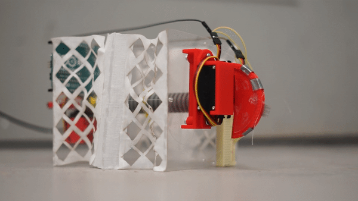
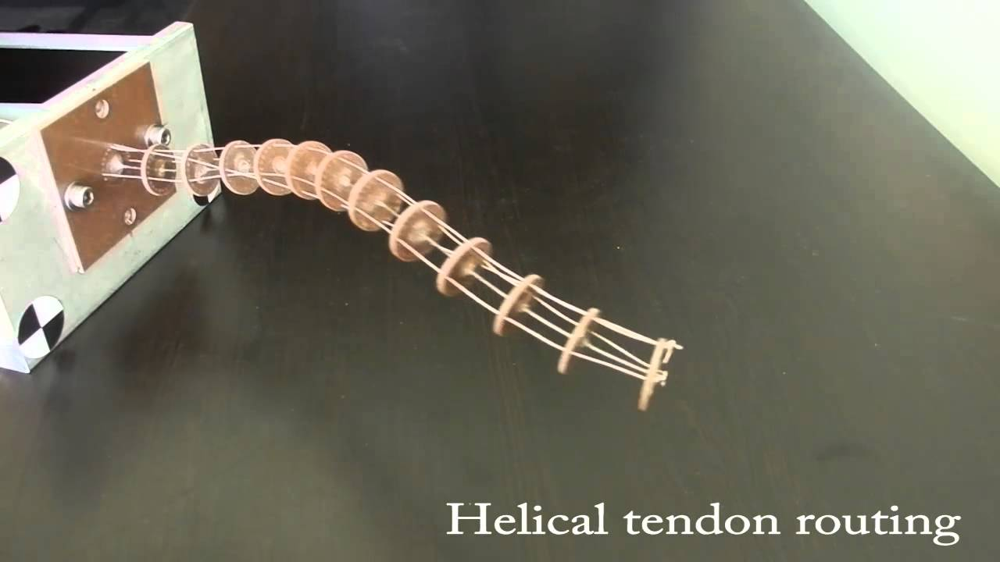
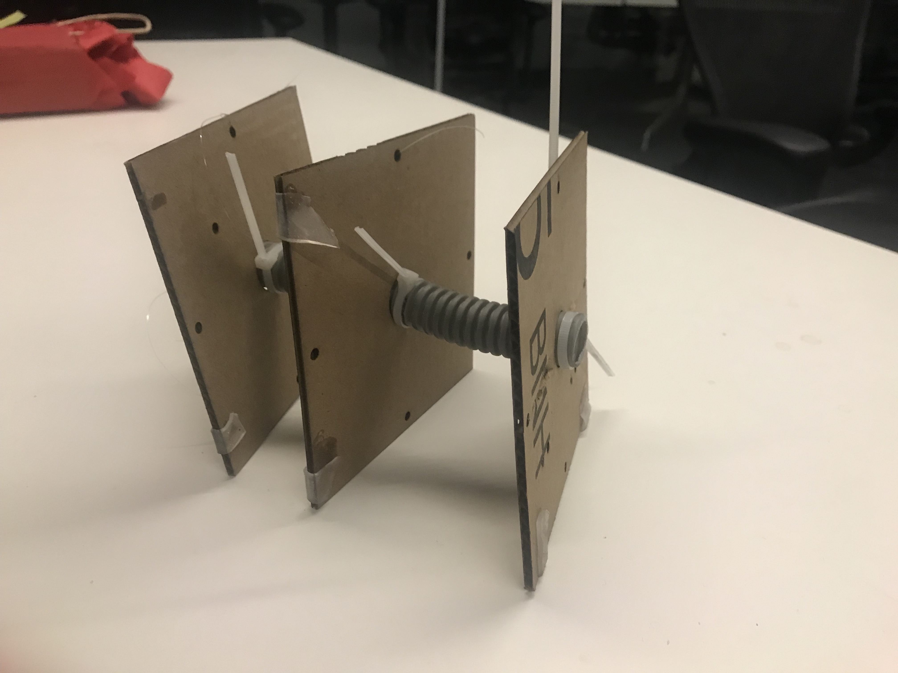
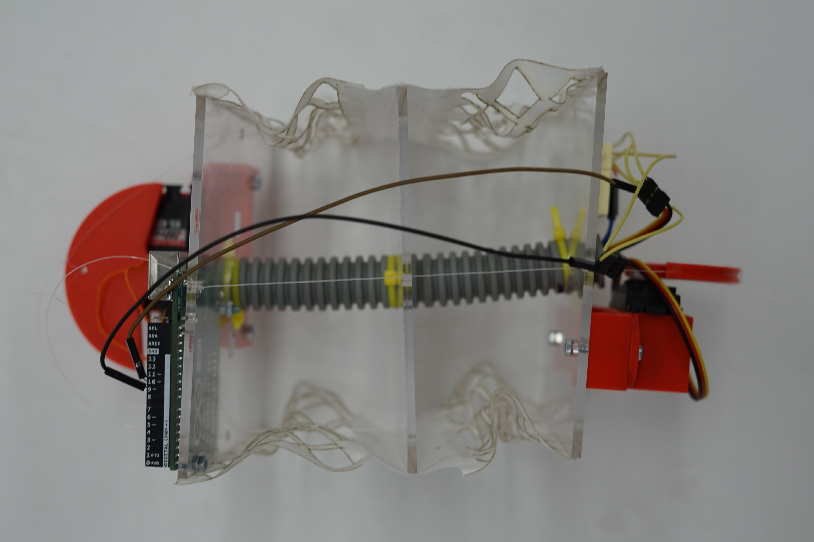

### Cuberpillar
###### February 2018

	

		
	

	

		<iframe width="560" height="315" src="https://www.youtube.com/embed/7CXaytbcfXY" frameborder="0" allow="accelerometer; autoplay; encrypted-media; gyroscope; picture-in-picture" allowfullscreen></iframe>
	

Cuberpillar was a project for [DEA 4210 Interaction Design Studio](https://classes.cornell.edu/browse/roster/SP18/class/DEA/4210). The prompt for this project was to build a box of wonder. Given how vague that was, I decided to create a box that didn\'t contain a wondrous experience, but instead acted in an unexpected or wondrous manner.

### Mechanism

For that I decided to use a continuum mechanism, a mechanism in which discrete segments are linked and can create organic movements. However, most continuum robots are long and snaking and are attached to a fixed base (like the one below)

	

		
		*A very typical continuum robot*
	

An example of a self-supporting cube or rectangular continuum robot seems to not exist in either the scientific literature or in any of my frantic Google searches. So the process of designing the robot became a long series of guess and check with multiple different sizes, flexible pipes, and mechanics till I finally arrived to the following cardboard prototype.

	

		
		*Special thanks to the local Lowes, zip-ties, and super glue for making this cardboard prototype possible*
	

Each side of every square plate has fishing line strung to the neighboring plate. At either end, a servo-driven pulley pulls at opposing sides of the plates, creating a "crawling" motion.

	

		
		*Top view of the box*
	

Each side of every square plate has fishing line strung to the neighboring plate. At either end, a servo-driven pulley pulls at opposing sides of the plates, creating a "crawling" motion. To cloak the "guts" of the box and add some structural support, I added patterned laser-cut fabric sheets along the sides.

### Reactions

Given that the box was meant to resemble a creature, one that acted entirely by itself with little to no input from a user, there was no real "user experience" per say. But as I was filming the box in action around the 2nd floor of Gates Hall for the video at the top of the page, I was receiving surprisingly strong reactions from those around it. Some reacted positively, calling it "cute." Some were surprisingly negative, with one of the PhDs saying "I have so much contempt for this thing," as it crawled along his desk. Another, when seeing that it often had trouble moving forward declared "I hate it because it reminds me of myself: writhing around but unable to go anywhere."

These reactions to the box, even though it wasn\'t meant to be "interactive" the way an app or website does, has made me think about the possibilities of robotics in art. Perhaps, a robot, more than being a simple tool, could be used to evoke questions about our nature and our inherent humanity. This I\'d like to explore further.

If you\'re interested in the more technical details about the project, checkout the documentation I submitted for the assigmnent [here](https://drive.google.com/file/d/19Vr0eK3bR2Fvb-IcK58ZRGgLr12up9rf/view?usp=sharing).