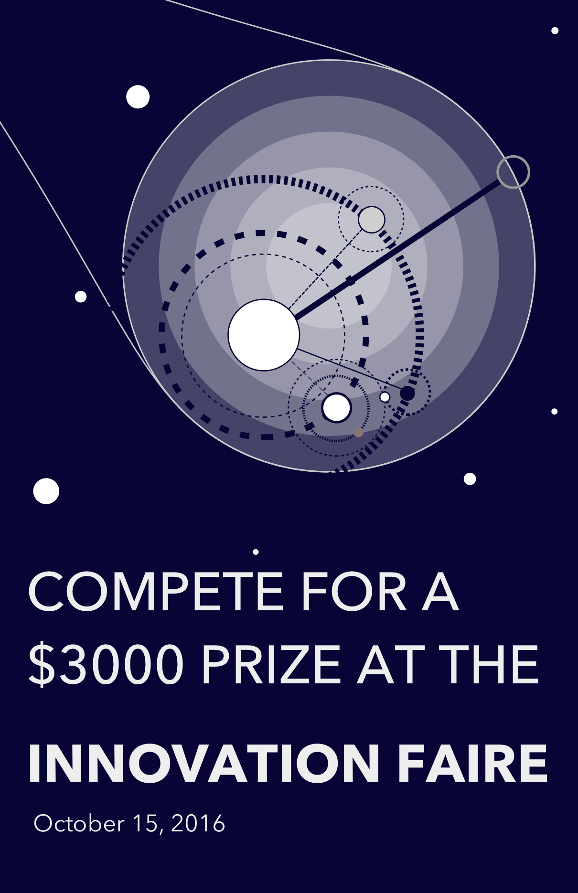
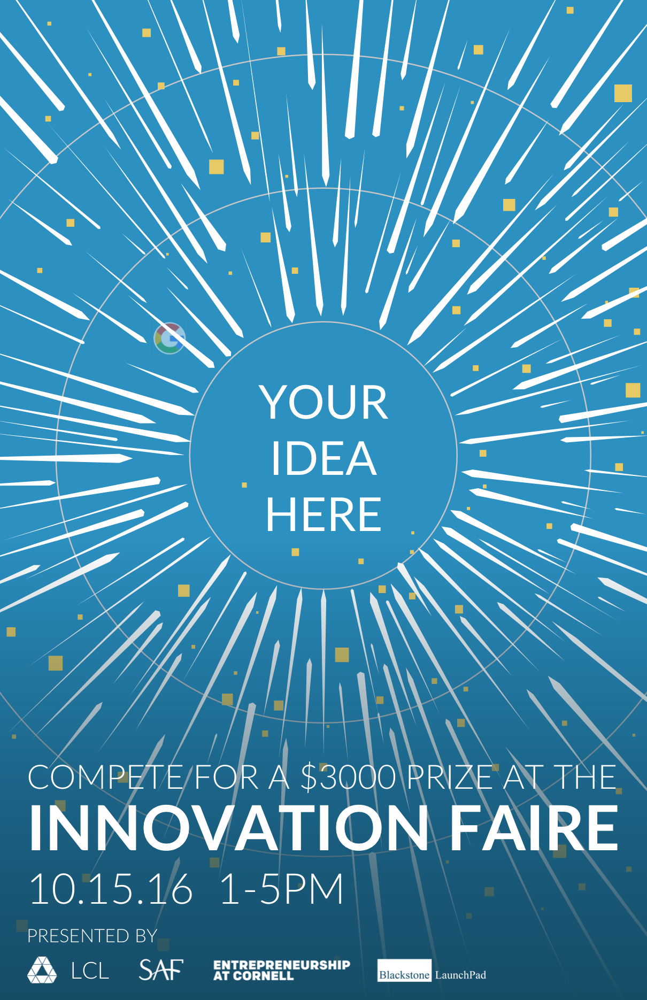

### Life Changing Labs
###### June 2016 - August 2019

I worked at Life Changing Labs’ Summer Incubator Program where I did design work for a few startups and LCL itself. Because of the nature of these startups, some of my work was placed under a non-disclosure agreement. However I can show some of my work for LCL specifically. Included in that work was promotional material for the cancelled Innovators Fair, an event for startups, student organizations, and individuals to display their ideas. A pitch competition for $3000 was supposed to occur at the end of the Fair.

	

		
		*An early version of the poster: I started with a general theme of space. The above poster was meant to represent illumination of a previously hidden constellation of ideas. While this design went unused, the spotlight was eventually used for OcularMD’s branding.*
	

	

		
		*A later version of the poster: While previous version of the poster simply illuminated ideas, this version was to show their centrality, in a way empowering people with ideas to display and share them.*
	

