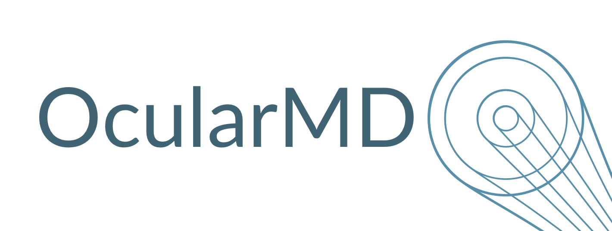
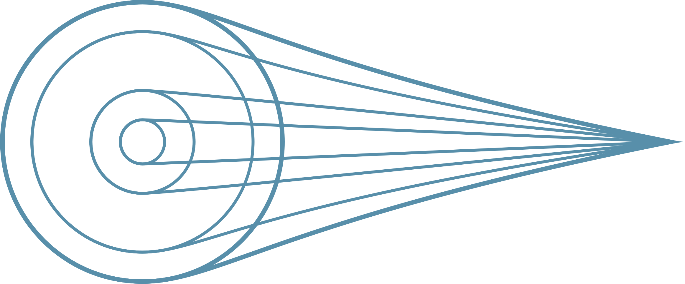
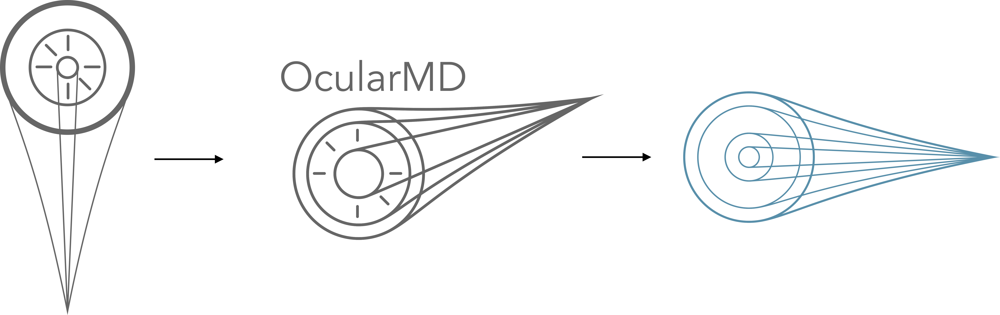
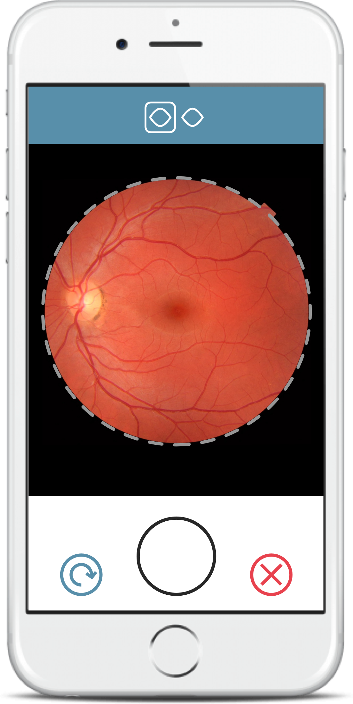
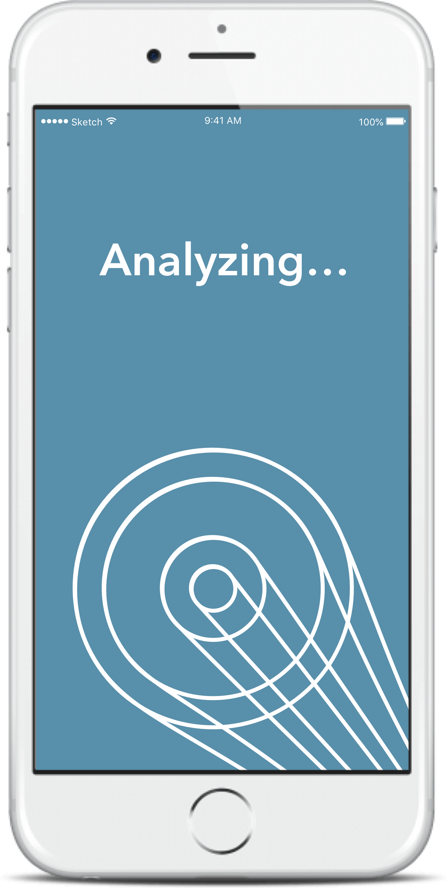
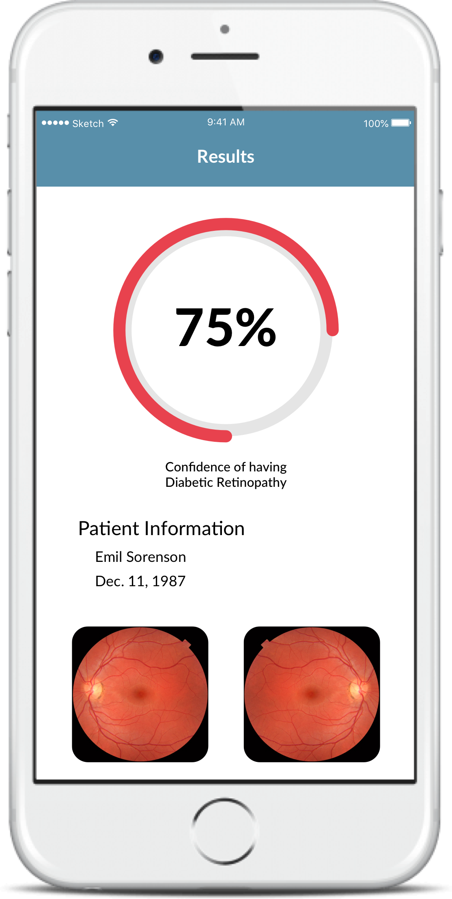

### OcularMD
###### November 2016

OcularMD started as a company for Cornell’s 3 Day Startup program where students found a startups, and present a final pitch in 3 days over one weekend. OcularMD was an app that could quickly diagnose diabetic retinopathy, a potentially blinding eye disease. Unlike previous works, I had to start completely from scratch, and I was able to make a corporate identity that was distinct and identifiable. OcularMD ended up wining 3 Day Startups\’ Big Red Venture Fund Seed Money Award, beating out four other startups founded at the same time.

	

		
		*The logomark had to be indicative of both a high-tech startup and a trusted medical company.*
	

	

		
		*The main part of OcularMD’s branding is the Spotlight, which symbolizes the company’s dedication to magnifying and illuminating the unknown.*
	

	

		
		*The different iterations of the Spotlight over the 3 days.*
	

	

		
	

	

		
	

	

		
	

	

		*The UI for the application is meant to be as straight-forward as possible by putting users through an easy step-by-step process. At the end, they receive a display of the results.*
	

	

		<iframe src="https://drive.google.com/file/d/1wRO5271vEMA4HX91rrzcAhK8Nl_pJgIw/preview" width="640" height="480"></iframe>
		*Pitch deck used during the 3 Day Startup Pitch competition.*
	

	

