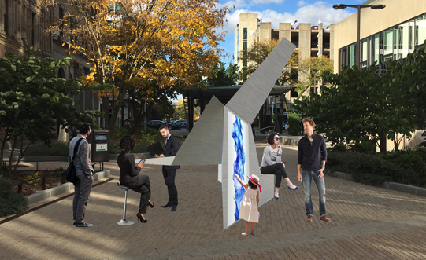

### transFORM
###### January 2019 - Onwards

*A potato-quality rendering of transFORM*

As part of my Master of Engineering (MEng) in Mechanical Engineering, I will be working on transFORM, a project of Prof. Keith Green\'s [Architectural Robotics Lab (ARL)](https://arl.human.cornell.edu/). transFORM is a room-scaled, kirigami-inspired robotic environment for public spaces. For more information, go to the [ARL page on transFORM](https://arl.human.cornell.edu/research-transFORM.html).

### Why?

I\'ve always been interested in architecture and for my Kessler Fellowship the summer my junior year, I interned at [Ori Inc](https://oriliving.com/), an MIT Media Lab spinoff building robotic furniture for urban apartments. During my time at Ori, I became increasingly interested in applying architectural robotics to the public realm. After all, if we could make apartments responsive, couldn\'t we do the same for a public plaza that was used by all walks of life? That\'s why I wanted to work on transFORM when I returned to Cornell.